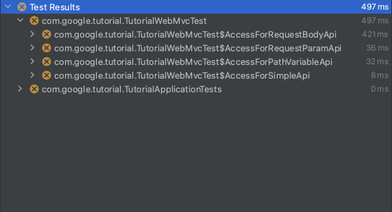
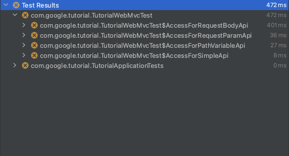

summary: Lab for Spring Cloud GCP for Cloud SQL - MySQL
id: codelab-spring-cloud-gcp-mysql
categories: spring,cloudsql
tags: cloudsql
status: Draft
authors: shinyay
Feedback Link: https://twitter.com/yanashin18618

# Lab for Spring Cloud GCP for Cloud SQL(MySQL)
<!-- ------------------------ -->
## Prerequisite 
Duration: 5

### Lab Environment
Install the following softwares:

- Java
- Docker ([https://www.docker.com](https://www.docker.com))
- Google Cloud SDK ([https://cloud.google.com/sdk](https://cloud.google.com/sdk))
  - [Instructions](https://cloud.google.com/sdk/docs/install)
- IDE
  - IntelliJ IDEA
  - VS Code
  - NetBeans
  - Eclipse

I have tested this tutorial in the following software environment:
- Java: openjdk 11.0.2 2019-01-15
- Docker v20.10.7
- Google Cloud SDK 358.0.0
- IDE: Intellij IDEA

```shell script
$ java --version
openjdk 11.0.2 2019-01-15
OpenJDK Runtime Environment 18.9 (build 11.0.2+9)
OpenJDK 64-Bit Server VM 18.9 (build 11.0.2+9, mixed mode)
```
```shell script
$ docker version
Client:
 Cloud integration: 1.0.17
 Version:           20.10.7
 API version:       1.41
 Go version:        go1.16.4
 Git commit:        f0df350
 Built:             Wed Jun  2 11:56:22 2021
 OS/Arch:           darwin/amd64
 Context:           default
 Experimental:      true

Server: Docker Engine - Community
 Engine:
  Version:          20.10.7
  API version:      1.41 (minimum version 1.12)
  Go version:       go1.13.15
  Git commit:       b0f5bc3
  Built:            Wed Jun  2 11:54:58 2021
  OS/Arch:          linux/amd64
  Experimental:     false
 containerd:
  Version:          1.4.6
  GitCommit:        d71fcd7d8303cbf684402823e425e9dd2e99285d
 runc:
  Version:          1.0.0-rc95
  GitCommit:        b9ee9c6314599f1b4a7f497e1f1f856fe433d3b7
 docker-init:
  Version:          0.19.0
  GitCommit:        de40ad0
```
```shell script
$ gcloud version
Google Cloud SDK 358.0.0
```

Positive
: You don't have to have the same version.

<!-- ------------------------ -->
## Introduction
Duration: 1

You will learn the followings through this lab:
- [Spring Cloud GCP for Cloud SQL](https://cloud.spring.io/spring-cloud-gcp/reference/html/#cloud-sql)
- [Spring Data JPA](https://docs.spring.io/spring-data/jpa/docs/current/reference/html/#reference)

### Spring Cloud GCP
I explained the overview of Spring Cloud GCP for Cloud SQL at the forllowing article:
- [Getting Started with Spring Cloud GCP: Cloud SQL](https://medium.com/@shinyay/getting-started-with-spring-cloud-gcp-cloud-sql-9ccdf40bcfbc)

This lab makes you enable to create the project and implement the application.

### Spring Data JPA
Spring Cloud GCP does not depend on the persistent framework, such as Spring JDBC, Spring Data JDBC or Spring Data JPA. I use Spring Data JPA as an example.

<!-- ------------------------ -->
## Java プロジェクトの準備
Duration: 3

### チュートリアル プロジェクトの取得

次のファイルをダウンロードし、適当な場所へ配置および展開をしてください。

- tutorial.tar.gz

<button>
  [Download](tutorial.tar.gz)
</button>

### チュートリアル プロジェクトの IDE 表示

展開後に適当なIDEでプロジェクトを開いてください。
なお、ビルドツールとして [Maven](https://maven.apache.org/) および [Gradle](https://gradle.org/) が実施可能です。


<!-- ------------------------ -->
## Spring Boot チュートリアル 概要
Duration: 1

Spring Boot チュートリアルプロジェクトには、予めテストコードを配置しています。
このテストコードを実施して、その結果を見ながらメインコードの実装を行っていきます。

各 IDE 環境やビルドツールによって、テストの実行方法が異なります。このチュートリアルでは、以下の組み合わせで作成していますが、各自の環境に読み替えて実施してください。
- IDE: `InteliJ IDEA`
- ビルドツール: `Maven`

IntelliJ + Maven の場合


IntelliJ + Gradle の場合


Maven Wrapper の場合
```shell script
$ mvnw test
```

Gradle Wrapper の場合
```shell script
$ gradlew test
```

<!-- ------------------------ -->
## 最初のテスト実行
Duration: 2

それでは、最初にテストを実行してみます。
テストを実行すると、メインコードの実装がまだないため、以下のようにエラーがテスト結果に表示されます。



これらのエラー内容を確認して、正常終了するように修正を行いながらコードを完成させます。

<!-- ------------------------ -->
## テスト: アプリケーションコンテキスト
Duration: 3

- 対象テストクラス: ApplicationContextTests



### ヒント: `contextLoads`

以下のようにエラーが表示されています。
```shell script
Error creating bean with name 'com.google.tutorial.TutorialApplicationTests': Unsatisfied dependency expressed through field 'controller'; nested exception is org.springframework.beans.factory.NoSuchBeanDefinitionException: No qualifying bean of type 'com.google.tutorial.controller.TutorialController' available: expected at least 1 bean which qualifies as autowire candidate. Dependency annotations: {@org.springframework.beans.factory.annotation.Autowired(required=true)}
```

これは、`@Autowired` により **Dependency Injection** される対象が存在しないために発生しているエラーです。
インジェクションを行おうとしている対象のクラス `TutorialController` のクラス定義を確認してください。

<!-- ------------------------ -->
## テスト完了
Duration: 1


全てのテストが正常終了し、アプリケーションの実装要件を全て満たしました。


以上で、このラボは終了です。
