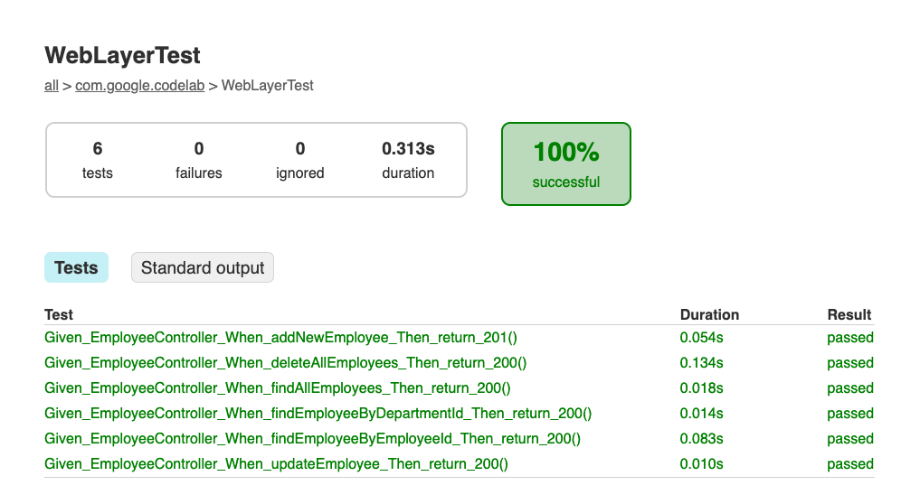
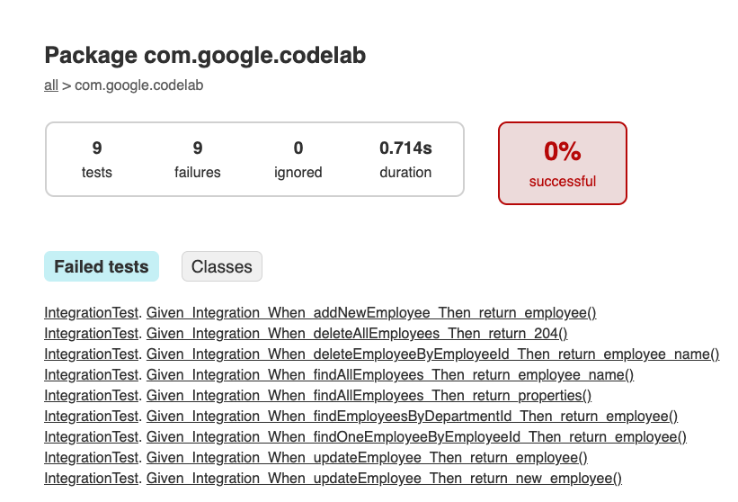
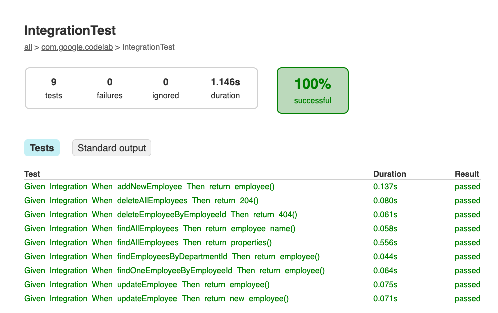

summary: Lab for Spring Cloud GCP for Cloud SQL - MySQL
id: codelab-spring-cloud-gcp-mysql
categories: spring,cloudsql
tags: cloudsql
status: Draft
authors: shinyay
Feedback Link: https://twitter.com/yanashin18618

# Lab for Spring Cloud GCP for Cloud SQL(MySQL)
<!-- ------------------------ -->
## Prerequisite 
Duration: 5

### Lab Environment
Install the following softwares:

- Java
- Docker ([https://www.docker.com](https://www.docker.com))
- Google Cloud SDK ([https://cloud.google.com/sdk](https://cloud.google.com/sdk))
  - [Instructions](https://cloud.google.com/sdk/docs/install)
- IDE
  - IntelliJ IDEA
  - VS Code
  - NetBeans
  - Eclipse

I have tested this tutorial in the following software environment:
- Java: openjdk 11.0.2 2019-01-15
- Docker v20.10.7
- Google Cloud SDK 358.0.0
- IDE: Intellij IDEA

```shell script
$ java --version
openjdk 11.0.2 2019-01-15
OpenJDK Runtime Environment 18.9 (build 11.0.2+9)
OpenJDK 64-Bit Server VM 18.9 (build 11.0.2+9, mixed mode)
```
```shell script
$ docker version
Client:
 Cloud integration: 1.0.17
 Version:           20.10.7
 API version:       1.41
 Go version:        go1.16.4
 Git commit:        f0df350
 Built:             Wed Jun  2 11:56:22 2021
 OS/Arch:           darwin/amd64
 Context:           default
 Experimental:      true

Server: Docker Engine - Community
 Engine:
  Version:          20.10.7
  API version:      1.41 (minimum version 1.12)
  Go version:       go1.13.15
  Git commit:       b0f5bc3
  Built:            Wed Jun  2 11:54:58 2021
  OS/Arch:          linux/amd64
  Experimental:     false
 containerd:
  Version:          1.4.6
  GitCommit:        d71fcd7d8303cbf684402823e425e9dd2e99285d
 runc:
  Version:          1.0.0-rc95
  GitCommit:        b9ee9c6314599f1b4a7f497e1f1f856fe433d3b7
 docker-init:
  Version:          0.19.0
  GitCommit:        de40ad0
```
```shell script
$ gcloud version
Google Cloud SDK 358.0.0
```

Positive
: You don't have to have the same version.

<!-- ------------------------ -->
## Introduction
Duration: 1

You will learn the followings through this lab:
- [Spring Cloud GCP for Cloud SQL](https://cloud.spring.io/spring-cloud-gcp/reference/html/#cloud-sql)
- [Spring Data JPA](https://docs.spring.io/spring-data/jpa/docs/current/reference/html/#reference)

### Spring Cloud GCP
I explained the overview of Spring Cloud GCP for Cloud SQL at the forllowing article:
- [Getting Started with Spring Cloud GCP: Cloud SQL](https://medium.com/@shinyay/getting-started-with-spring-cloud-gcp-cloud-sql-9ccdf40bcfbc)

This lab makes you enable to create the project and implement the application.

### Spring Data JPA
Spring Data JPA provides repository support for the Java Persistence API (JPA). It eases development of applications that need to access JPA data sources.

Positive
: Spring Cloud GCP does not depend on the persistent framework, such as Spring JDBC, Spring Data JDBC or Spring Data JPA. I use Spring Data JPA as an example.


<!-- ------------------------ -->
## Preparing a Project template
Duration: 3

### Expanding a project template archive

Download the folloing file and expand it at the proper directory.

- tutorial.tar.gz

<button>
  [Download](tutorial.tar.gz)
</button>

### Import the project template into your IDE

Open the project template from your IDE.

Positive
: You can choose either [Maven](https://maven.apache.org/) or [Gradle](https://gradle.org/) as a build tool.

<!-- ------------------------ -->
## How to proceed with the lab
Duration: 1

Test code is placed in the tutorial project in advance. You will implement the application code by executing the test codes and seeing the results, just like Test Driven Development.

Each IDE and build tool has a different way to run tests.　In this tutorial, I have used the following combination, but you can adapt it to your own environment.

- IDE: `InteliJ IDEA`
- Build tool: `Gradle`

Case: IntelliJ + Maven


Case: IntelliJ + Gradle


Case: CLI + Maven Wrapper
```shell script
$ mvnw test
```

Case: CLI + Gradle Wrapper
```shell script
$ gradlew test
```

<!-- ------------------------ -->
## Test Code Overview
Duration: 2

This lab has three kinds of test codes:
- Persistence layer Unit test
- Web layer Unit test
- Integration Test


<!-- ------------------------ -->
## Persistence layer Unit test
Duration: 5

- Test class: RepositoryTest

First of all, run the persistence layer test:

```shell
$ ./gradlew test --tests "*RepositoryTest" -i
```

Now you can see the following result because you don't have implemented any logics at all yet.
I have put a few codes:

- Entity template class
- Repository interface
- Service template class


Now then you can check the result and implement the persistence logic.

### Clue: `Given_employee_When_findAll_Then_countInitialValue()`

#### Enitity definition
You might see the following error messaeg:

```java
Caused by: java.lang.IllegalArgumentException: Not a managed type: class com.google.codelab.entity.Employee
```

As I describe above, this application uses `Spring Data JPA`. Therefore you need to define entity.

#### Coulumn name mismatch

```java
Caused by: java.sql.SQLSyntaxErrorException: Unknown column 'employee0_.emp_id' in 'field list'
```

You can define the custom column name with `@Column` annotation. 

The schema is defined by `V1__Create_Employee_table.sql`:

```sql
CREATE TABLE employee
(
    employee_id   integer     NOT NULL AUTO_INCREMENT,
    employee_name varchar(64) NOT NULL UNIQUE,
    role          varchar(32) DEFAULT NULL,
    PRIMARY KEY (employee_id)
);
```

#### Custom interface
You can find a built-in method when you see `Given_employee_When_find_by_id_Then_querySpecificEmployee`:

```java
Optional<Employee> result = repository.findById(1L);
```

If you define the custom interface, you need to implement it at the Repository interface. In this lab, the following interface has been already coded:

```java
public interface EmployeeRepository extends JpaRepository<Employee, Long> {
    List<Employee> findByDepId(long l);
}
```

### All test passed
Implement the application so that it passes all tests.


<!-- ------------------------ -->
## Web layer Unit test
Duration: 10

- Test class: WebLayerTest

Second of all, run the web layer test:

```shell
$ ./gradlew test --tests "*WebLayerTest" -i
```

Now you can see the following result because you don't have implemented any logics at controller and service class.


Now then you can check the result and implement the persistence logic.

### Clue: `Given_EmployeeController_When_findAllEmployees_Then_return_200()`

#### API Undefined
You will see such as the following error message:

```java
java.lang.AssertionError: Status expected:<200> but was:<404>
```

It means the api is not defined yet. Now take a look at the test code:

```java
    @MockBean
    private EmployeeService service;
    private List<Employee> employeeList;
        :
        Mockito.when(service.findAllEmployees()).thenReturn(employeeList);

        mockMvc.perform(get("/api/v1/employees"))
                .andDo(print())
                .andExpect(status().isOk());
```

This test code describes the followings:
- This application has `EmployeeService` class as service layer
- The service class has `findAllEmployees` method which returns `List<Employee>`
- This API's endpoint is `/api/v1/employees` to access by `GET` 

### Clue: `Given_EmployeeController_When_addNewEmployee_Then_return_201()`

#### HTTP Response code mismatch
You will see such as the following error message:

```java
java.lang.AssertionError: Status expected:<201> but was:<405>
```

It means this API returns `CREATE (201)` not 200. Now take a look at the test code:

```java
    @Test
    public void Given_EmployeeController_When_addNewEmployee_Then_return_201() throws Exception {

        var json = mapper.writeValueAsString(employeeData);

        Mockito.when(service.registerEmployee(employeeData)).thenReturn(employeeData);

        mockMvc.perform(
                post("/api/v1/employees")
                        .contentType(MediaType.APPLICATION_JSON)
                        .content(json)
                        .accept(MediaType.APPLICATION_JSON)
                )
                .andDo(print())
                .andExpect(status().isCreated());
    }
```

This test code describes the followings:
- The service class has `registerEmployee` method which has `Employee` parameter and returns `Employee`
- This API's endpoint is `/api/v1/employees` to access by `POST`
- It returns `CREATED (201)`

### Clue
You can implement the other methos in the same way.



<!-- ------------------------ -->
## Integration test
Duration: 10

- Test class: IntegrationTest

Now then, run the integration test between web and database:

```shell
$ ./gradlew test --tests "*IntegrationTest" -i
```

Now you can see the following result because you don't have implemented any logics at controller and service class.



### Clue: `Given_Integration_When_findAllEmployees_Then_return_properties()`

#### Coulumn name mismatch
You will see such as the following error message:

```java
Caused by: java.sql.SQLSyntaxErrorException: Unknown column 'employee0_.dep_id' in 'field list'
```

You can define the custom column name with `@Column` annotation. 

The column is added by `V3__Alter_Employee_Add_DepartmentId.sql`:

```sql
ALTER TABLE employee
    ADD department_id integer NOT NULL
    AFTER employee_id;
ALTER TABLE employee
    ADD FOREIGN KEY (department_id) REFERENCES department (department_id);
```

### Clue: `Given_Integration_When_deleteEmployeeByEmployeeId_Then_return_404()`

#### Not Supported API
You will see such as the following error message:

```java
java.lang.AssertionError: Status expected:<200> but was:<405>
```

As you might have known, `HTTP Status: 405` is `Method Not Allowed`, which means your http method is wrong.

Now take a look at the test code:

```java
        mockMvc.perform(delete("/api/v1/employees/1"))
                .andDo(print())
                .andExpect(status().isOk());
```

The above code expects DELETE method with employee id. It might be good to check your api.

### Clue
You can implement the other methos in the same way.



<!-- ------------------------ -->
## Boot run on local
Duration: 10

Let's boot run the application when all the tests are passed:

```shell
$ ./gradlew clean bootRun
```

### Failed boot run

You will see the application can not run because of `Flyway` dependency. I use it to test the application for testing with database.

```
***************************
APPLICATION FAILED TO START
***************************

Description:

Flyway failed to initialize: none of the following migration scripts locations could be found:

        - classpath:db/migration


Action:

Review the locations above or check your Flyway configuration
```

Therefore you have to disable `Flyway`. The easiest way is to remove the dependency from `build.gradle` or `pom.xml`.

The more efficient way is to configure flyway on `application.properties` or `application.yml`

```yaml
spring:
  flyway:
    enabled: false
```

### Database on local
You have not prepared for the database though, I have already added the dependency of H2 database which is embedded database to `build.gradle` and `pom.xml`.

This will enable you to use the database.

```
dependencies {
	runtimeOnly 'com.h2database:h2'
}
```

### Boot run again

Now then, let's boot run again.

```shell
$ ./gradlew clean bootRun
```

You will see the followings:

```
> Task :compileJava
Note: /Users/shinyay/works/spring/codelab-spring-cloud-gcp-mysql-code-java/src/main/java/com/google/codelab/controller/EmployeeController.java uses unchecked or unsafe operations.
Note: Recompile with -Xlint:unchecked for details.

> Task :bootRun

  .   ____          _            __ _ _
 /\\ / ___'_ __ _ _(_)_ __  __ _ \ \ \ \
( ( )\___ | '_ | '_| | '_ \/ _` | \ \ \ \
 \\/  ___)| |_)| | | | | || (_| |  ) ) ) )
  '  |____| .__|_| |_|_| |_\__, | / / / /
 =========|_|==============|___/=/_/_/_/
 :: Spring Boot ::                (v2.5.4)
    :
    :
2021-09-28 22:05:25.085  INFO 34100 --- [           main] o.s.b.w.embedded.tomcat.TomcatWebServer  : Tomcat started on port(s): 8080 (http) with context path ''
2021-09-28 22:05:25.094  INFO 34100 --- [           main] com.google.codelab.TutorialApplication   : Started TutorialApplication in 3.776 seconds (JVM running for 4.153)
```


<!-- ------------------------ -->
## Completed
Duration: 1


全てのテストが正常終了し、アプリケーションの実装要件を全て満たしました。


以上で、このラボは終了です。
